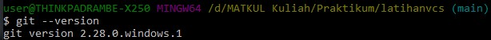
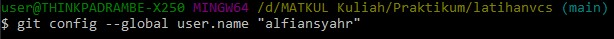
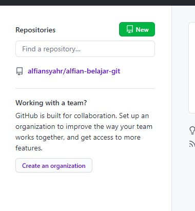
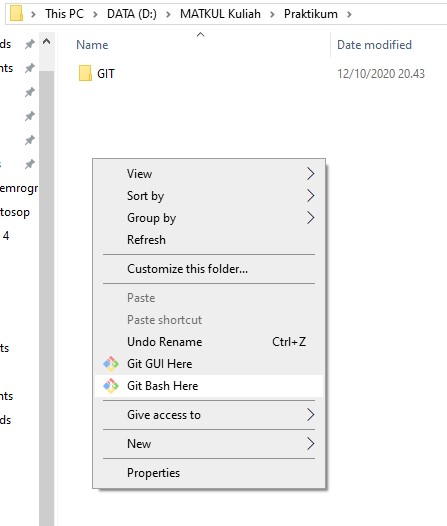
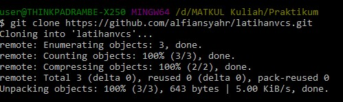
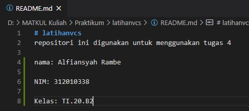
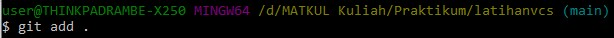
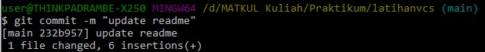

# latihanvcs
repositori ini digunakan untuk menggunakan tugas 4

nama: Alfiansyah Rambe 

NIM: 312010338

Kelas: TI.20.B2

## langkah langkah pembuatan vcs
* langkah pertama silahkan download file git

* langkah kedua cek version di Git Bash

* langkah ketiga beri nama user GIT

* langkah keempat buatlah akun GIT HUB di github.com

* langkah kelima buat repository di github.com

* langkah keenam buka gitbash di folder

* langkah ketujuh git clone di folder

* langkah kedelapan edit file README.md

* langkah kesembilan Ketik git add 

* langkah kesepuluh ketik git commit

* Langkah kesebelas ketik git push
* langkah keduabelas buka github.com lalu refresh